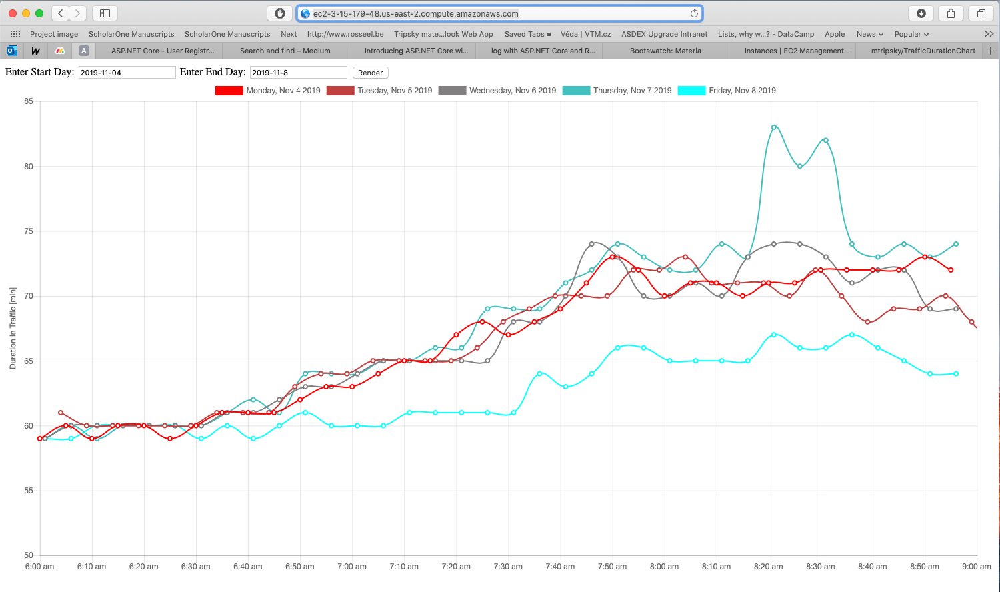

# google-maps-service

This project query `googleapis.com` to get the distance matrix between origin and
destination address. Then, it saves duration in the traffic using `google` traffic model into my Mongo database running on MongoDB Atlas cloud. This service is running
on my AWS cloud [1](http://ec2-3-15-179-48.us-east-2.compute.amazonaws.com), where another service [2](https://github.com/mtripsky/TrafficDurationChart) query the database to draw the duration in traffic to get this graph:

